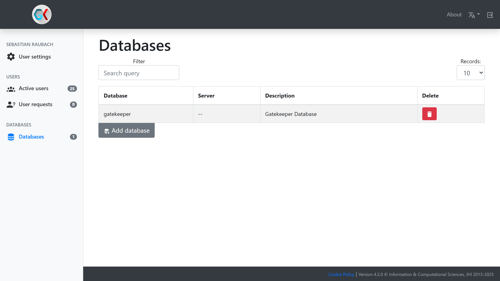
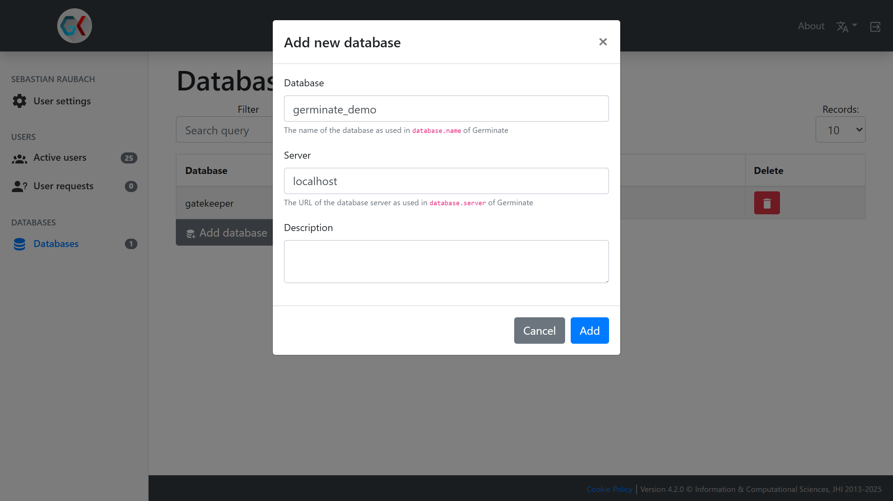

# Gatekeeper Adding Systems

Each instance of Germinate requires an entry on the `Databases` interface of Gatekeeper. When logged in as a Gatekeeper
admininstrator, navigate to the `Databases` page using the side menu. The table you see here shows all existing database
systems currently defined within Gatekeeper.

To add a new system (Gatekeeper instance), click the `Add database` button.
This will show a window where you specify the database table name and the database server location. These **have to**
match the `database.name` and `database.server` entries in Germinate's `config.properties` file. Optionally, provide a
description for this system.

## Granting access to a system

Once the system is in place, users can be given access to the system. To do this, go to the `Active users` page and find
the user in question. 

## Seeing all users with access to a system

On the `Databases` page, select the system in question from the table by clicking on it. A table will be shown containing
all users who currently have access to this system with their access rights (user type). You can change the access rights
using the dropdown menu and you can also remove access to a system for a specific user from here.

