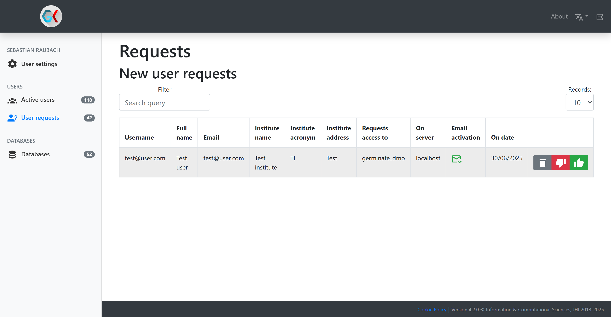

# Gatekeeper User Access Requests

In addition to adding users individually and setting temporary passwords for them, you can also ask them to register
for access to the corresponding Germinate instance themselves. This has to be enabled by the Germinate instance using
the `gatekeeper.registration.enabled` property. Additionally, the Germinate property `gatekeeper.registration.requires.approval`
determines whether user requests are automatically granted or whether a primary contact of this Germinate instance has
to approve the request manually.

When a new user requests access via this method, the primary contact of the Germinate instance will be notified and has
to log into Gatekeeper. They can then go to the `User requests` page to see all access requests awaiting a decision.

You can see information about the user as well as the system they requested access to. `Email activation` indicates
whether they have verified their email address or not. The three buttons at the end are the possible decisions for this
request:

- Thumbs down: Reject the access request. The user will be notified of this decision. You can provide additional
information for the refusal which will be included in the email.
- Thumbs up: Accept the access request. This will grant them access to the corresponding Germinate instance as a regular
user. You can upgrade their permissions after granting access using `Active users`.
- Delete: In case you do not want to grant access to the user but also don't want to notify them about the decision, the
delete button will just remove their access request entry.