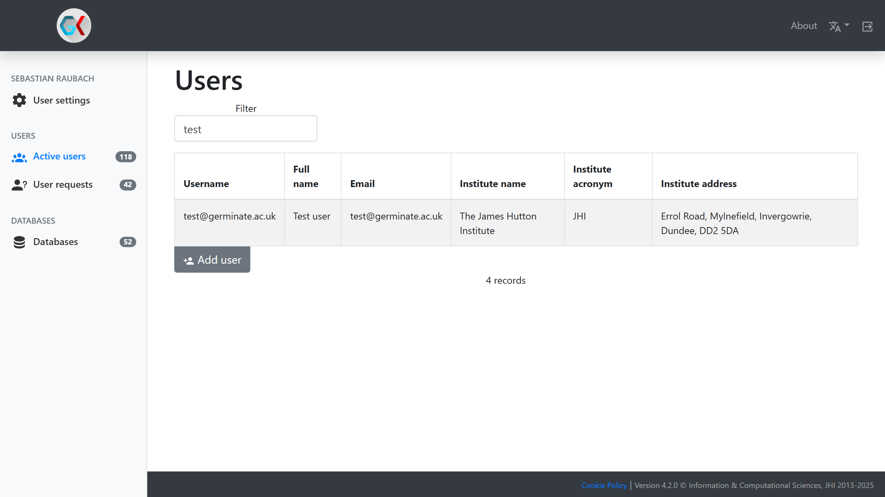
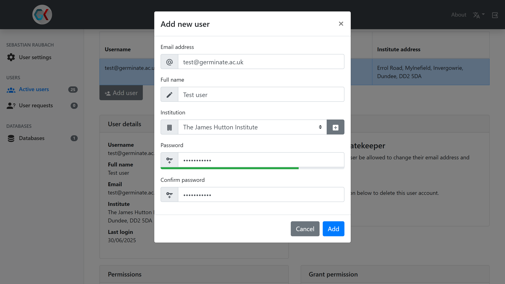
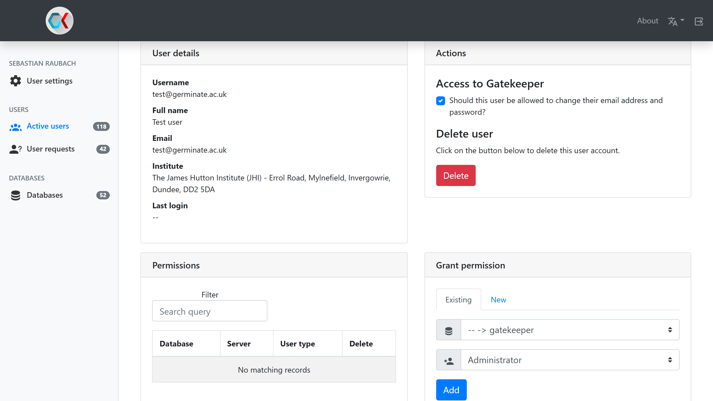

# Gatekeeper Adding Users

Users in the context of Gatekeeper can be one of two types:

1. A genuine person who wants to access data within Germinate.
2. A Germinate instance trying to access the database.

Each Germinate instance should have one such user of type 2. The details for this user can be added to Germinate's
`config.properties` file under the `gatekeeper.username` and `gatekeeper.password` properties. This process usually only
has to be done once when the system is put in place and won't have to be touched again afterwards.

Individual users of type 1 authenticate on Germinate using their email address and a password which Germinate will pass
to Gatekeeper to verify their access permissions. Users of this type can be added, changed and removed as required.

To add a new user (of either type), go to `Active users` in the side menu of Gatekeeper when logged in as an administrator.
A table will show you all users who are currently registered with Gatekeeper. You can search for specific users with the
search filter. Adding a new user is achieved by clicking the `Add user` button below the table.

A new window opens asking you to provide their contact email address, full name and institution. You can add new institutions
by clicking the small button with a plus icon next to the institution dropdown. Set an initial password for the user and
confirm it below. The new user will appear at the bottom of the table.

Selecting a user from the table shows their details in a few sections below the table. The first section contains details
like their full name, email and institute. The second section regulates whether they are allowed to log into Gatekeeper
to reset their password. Users can also be deleted from here. The third section shows which permissions the currently
selected user has on which system. The access permissions on a system can be adjusted using the dropdown menu while
they can also be deleted completely using the delete button. The fourth and final section allows adding new permissions
for this user. To do this, select the database system (Germinate instance or Gatekeeper) from the list, then select the
permission level they should have and click the `Add` button to grant these permissions.

